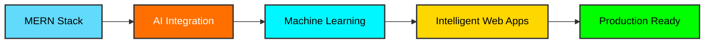

<div align="center">

<!-- Animated Header -->


<!-- Typing SVG -->
<a href="https://git.io/typing-svg"></a>

<!-- Profile Views Counter -->


<!-- GitHub Stats Badges -->


</div>

---

<div align="center">

## 💫 **About Me**

</div>

```javascript
const kavita = {
    role: "MERN Stack + AI Developer",
    location: "🌍 Building the Future with Code",
    focus: ["Full-Stack Development", "AI Integration", "Machine Learning"],
    currentlyLearning: ["Next.js", "AI/ML Models", "LangChain", "Vector Databases"],
    collaborationInterests: ["Open Source", "AI-Powered Web Apps", "Full-Stack Projects"],
    techPassion: "Creating intelligent, responsive web applications 🚀",
    funFact: "I turn coffee ☕ into code and bugs into features! 🐛➡️✨",
    pronouns: "She/Her",
    mantra: "Code. Build. Innovate. Repeat. 🔄"
};
```

<div align="center">

### 🎯 **What Drives Me**

</div>

<table align="center">
<tr>
<td align="center" width="33%">

<br><b>Full-Stack Mastery</b>
<br>Building end-to-end solutions with MERN
</td>
<td align="center" width="33%">

<br><b>AI Integration</b>
<br>Embedding intelligence into web apps
</td>
<td align="center" width="33%">

<br><b>Clean Code</b>
<br>Writing maintainable, scalable solutions
</td>
</tr>
</table>

---

<div align="center">

## 🌐 **Connect With Me**

<a href="https://portfolio-rouge-nine-hdqixoua7x.vercel.app/"></a>
<a href="https://www.linkedin.com/in/kavita-luhana-0a31842ab/"></a>
<a href="https://github.com/Kavita-LachmanDas"></a>
<a href="mailto:kavitaluhana11@gmail.com"></a>

</div>

---

<div align="center">

## 💻 **Tech Stack & Tools**

### **Frontend Development**


### **Backend Development**


### **AI & Machine Learning**


### **Tools & Platforms**


</div>

---

<div align="center">

## 📊 **GitHub Analytics**


</div>

<div align="center">

## 🔥 **Contribution Streak**


</div>

<div align="center">

## 🏆 **GitHub Trophies**


</div>

---

<div align="center">

## 📈 **Contribution Graph**


</div>

---

<div align="center">

## 🎨 **Featured Projects**

<a href="https://github.com/Kavita-LachmanDas">
  
</a>
<a href="https://github.com/Kavita-LachmanDas">
  
</a>

</div>

---

<div align="center">

## 💭 **Random Dev Quote**


</div>

---

<div align="center">

## 🐍 **Contribution Snake**

<picture>
  <source media="(prefers-color-scheme: dark)" srcset="https://raw.githubusercontent.com/Kavita-LachmanDas/Kavita-LachmanDas/output/github-contribution-grid-snake-dark.svg">
  <source media="(prefers-color-scheme: light)" srcset="https://raw.githubusercontent.com/Kavita-LachmanDas/Kavita-LachmanDas/output/github-contribution-grid-snake.svg">
  
</picture>

</div>

---

<div align="center">

## 💡 **Current Focus**



</div>

---

<div align="center">

## 📫 **Get In Touch**

 <em><b>I love connecting with different people</b> so if you want to say <b>hi, I'll be happy to meet you!</b> 😊</em>

**Let's build something amazing together! 🚀**

<a href="mailto:kavitaluhana11@gmail.com">
  
</a>

</div>

---

<div align="center">

### ⭐ **From [Kavita-LachmanDas](https://github.com/Kavita-LachmanDas) with 💖**


</div>
